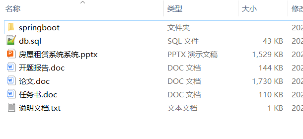
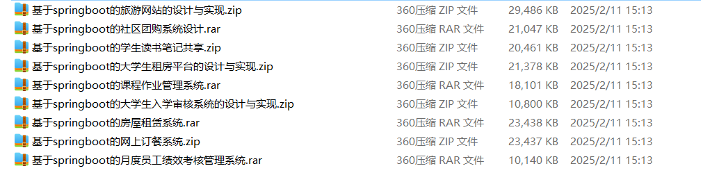

# springboot_career_photography_library

📦 SpringBoot多功能项目仓库 🎯

本仓库汇集了三个基于 **SpringBoot** 开发的高实用性项目，涵盖职业规划、摄影分享、图书管理 等多个领域，适用于学习、开发实践和功能拓展！🚀

💼 IT职业生涯规划系统 —— 提供职业测评、技能发展建议、求职指导、岗位推荐等功能，助力IT从业者高效规划职业路径 🎯📊

📸 摄影分享网站系统 —— 支持图片上传、相册管理、社区互动、作品展示，打造摄影爱好者的创作与交流平台 📷✨

📚 图书借还管理系统 —— 实现图书分类、借阅登记、归还提醒、借阅统计，提高图书馆管理效率 📖🏫
所有项目均基于 **SpringBoot** 开发，结合 **MySQL、Redis、Vue.js** 等主流技术，具备良好的扩展性与实用性。

**项目部署说明**✨：

推荐使用：**谷歌浏览器**

**后台地址**😎

http://localhost:8080/springboot/admin/dist/index.html

**前台地址**😎

http://localhost:8080/springboot547vl/front/index.html

在**src\main\resources\application.yml中**编辑数据库配置🎉										
url: jdbc:mysql://127.0.0.1:3306/springboot?useUnicode=true&characterEncoding=utf-	8&useJDBCCompliantTimezoneShift=true&useLegacyDatetimeCode=false&serverTimezone=UTC
username: root
password: 123456

**文档预览**👀

**其他项目合集**✨

